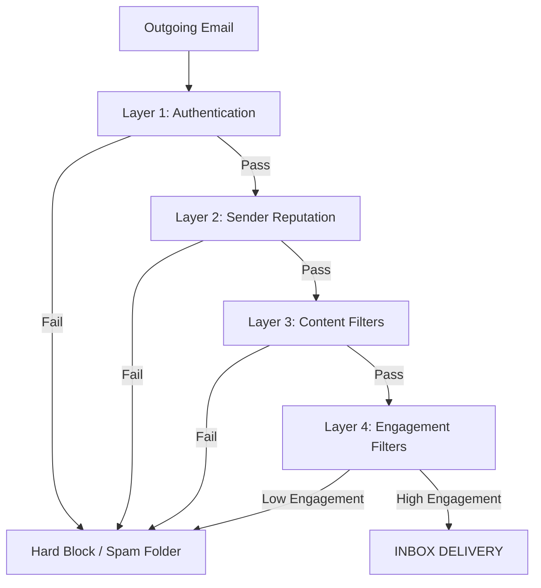

# Expert Guide: Maximizing Inbox Placement & Avoiding Spam Filters in 2026

When sending marketing or transactional email campaigns, clearing modern spam filters is no longer just about avoiding words like "FREE." In 2026, mailbox providers (Gmail, Outlook, Yahoo) use **strict machine-learning filters** and **mandatory sender requirements** to block, quarantine, or permanently reject emails before they ever reach the recipient.

This report audits your mail marketing system's current codebase, analyzes it against the latest industry standards, and outlines concrete actions you can take to prevent emails from landing in the spam folder.

---

## 1. Codebase Deliverability Audit

We reviewed your backend codebase ([index.js](file:///c:/Desire-Mail-Marketing-Excel/backend/src/index.js) and [email.js](file:///c:/Desire-Mail-Marketing-Excel/backend/src/email.js)) against the 2026 sender mandates. Here is the evaluation:

### 🟢 What the Codebase Does Well (Good Deliverability Signals)
* **Multipart MIME Support:** In `index.js`, when rendering templates, you generate both `html` and `plainText` alternatives. `nodemailer` packages these into a proper `multipart/alternative` structure. Spam filters punish emails that lack plain-text alternatives.
* **Instant Unsubscribe Database Updates:** Your `/unsubscribe/:token` endpoint handles opt-outs instantly. Standard guidelines require unsubscribes to be processed within 2 days; your codebase does it in milliseconds.
* **Domain Check Guard:** In `email.js`, the code checks if `AZURE_COMMUNICATION_CONNECTION_STRING` contains the default placeholder (`your-resource`). If it does, it disables Azure and falls back to SMTP, preventing configuration errors.
* **Recipient Quality Control:** During Excel parsing, your backend runs a regex email syntax validation, filters out duplicates, and automatically marks unsubscribed emails as `skipped`. This is a vital deliverability practice.

### 🔴 Deliverability Vulnerabilities in the Current Code (Risk Factors)
* **Missing One-Click Unsubscribe Headers (RFC 8058):** Gmail and Yahoo require bulk senders to include `List-Unsubscribe` and `List-Unsubscribe-Post` headers in the email envelope to allow users to unsubscribe directly from the email client UI. Your `nodemailer` setup does not include these headers.
* **No Outbound Rate Throttling for SMTP:** Microsoft Office 365 has a strict rate limit of **30 messages per minute**. If you run a campaign, your code attempts to send emails as fast as possible with only a static delay. Exceeding Microsoft's rate limits causes the server to block your IP or account.
* **Lack of Domain/DMARC Alignment:** If the user authenticates with one domain but specifies a different `From` address in their template headers, it will trigger a **DMARC alignment failure** and result in immediate spam filtering or hard rejection.
* **No Pre-Send Content Validation:** The template editor does not alert the user if they write spam trigger words or include broken HTML structures.

---

## 2. The 4 Layers of Deliverability Checks

To make sure your emails reach the inbox, they must clear the four layers of modern spam filters:



### Layer 1: Authentication (SPF, DKIM, DMARC)
Mailbox providers perform cryptographic checks to verify that your sending server is authorized to send emails on behalf of your domain:
1. **SPF (Sender Policy Framework):** A TXT record in your domain's DNS listing the IP addresses authorized to send emails.
2. **DKIM (DomainKeys Identified Mail):** A cryptographic signature injected into the headers of every email. The receiving server uses the public key published in your domain's DNS to verify the signature.
3. **DMARC (Domain-based Message Authentication, Reporting, and Conformance):** A policy telling the receiver what to do if SPF or DKIM checks fail (options: `none`, `quarantine`, or `reject`).

> [!IMPORTANT]
> **Domain Alignment Requirement:** The domain in the `From:` header of the email **must match** the domain validated by SPF and DKIM. If they do not align, DMARC will fail.

### Layer 2: Sender Reputation (IP & Domain)
Every sending domain and IP has a credit score.
* **Blocklists:** If your IP or domain gets flagged for sending unsolicited email, it is listed on global blocklists (like Spamhaus or Barracuda) and blocked immediately.
* **Shared IP Risks:** If you use a shared SMTP server with poor configuration, other spammers using the same IP can ruin your delivery rates.

### Layer 3: Content Filters
Automatic parsers read your email content:
* **Text-to-Image Ratio:** Emails should have a balanced ratio (recommended **60% text, 40% image**). Image-only emails are heavily filtered because spam filters cannot read text hidden inside images.
* **Spam Trigger Words:** Extreme urgency words ("Act Now!", "Winner", "Free Money") or excessive punctuation ("!!!", "$$$") increase spam scores.
* **Broken HTML:** Unclosed tags or leftover web CSS are viewed as suspicious by spam filters.

### Layer 4: Engagement Filters (The Dominant Signal in 2026)
Gmail, Yahoo, and Microsoft track user behavior.
* **Positive Signals:** Opens, reads, replies, forwards, and moving emails from "Spam/Promotions" to "Primary".
* **Negative Signals:** High delete-without-opening rates, high unsubscribe rates, and **Spam Complaints** (subscribers clicking "Report Spam"). 
* *Rule of thumb:* Keep your spam complaint rate **below 0.10%** (and never let it exceed 0.3%).

---

## 3. Recommended Actions & Next Steps

To build a professional, production-level system that consistently hits the inbox, we recommend implementing the following improvements:

### 1. Integrate RFC 8058 One-Click Unsubscribe Headers
We can modify the `nodemailer` sending logic to automatically inject the required headers. This will allow email clients (like Gmail) to display an "Unsubscribe" button at the top of the email, reducing the likelihood of users clicking "Report Spam".

```javascript
// Example modification for backend/src/email.js
const info = await smtpTransporter.sendMail({
  from: fromAddress,
  to: options.to,
  subject: options.subject,
  html: options.html,
  text: options.text,
  headers: {
    'List-Unsubscribe': `<${unsubscribeLink}>`,
    'List-Unsubscribe-Post': 'List-Unsubscribe=One-Click'
  }
});
```

### 2. Transition from Office 365 to a Transactional Mailer
Instead of using a personal Office 365 account (`smtp.office365.com`), we should configure a developer-friendly transactional mailer like **Resend**, **Brevo**, or **Amazon SES**. This will:
* Remove Microsoft's strict 30-mails-per-minute throttle.
* Allow easy setup of SPF, DKIM, and DMARC alignment.
* Provide webhooks to track bounces (completed), clicks, and opens automatically.

### 3. Build a Pre-Send Content Scanner in the Template Editor
We can add a helper class in the backend (or utility in the frontend) to scan template HTML/text before sending and return a score:
* **Trigger Word Scanner:** Check content against a list of spam trigger words and warn the user.
* **Text-to-Image Analyzer:** Calculate the character-to-image count ratio and alert the user if the layout is too image-heavy.

### 4. Implement Dynamic Throttling (IP Warmup Safeguard)
We can implement a sending queue that dynamically throttles the batch rate depending on the recipient domains, helping new domains warm up their sending reputation gradually (e.g. sending at a slow, steady rate rather than dumping hundreds of emails in a few seconds).

---

## 4. Reference: Spam Trigger Words to Avoid

When creating email copy, avoid using the following words or phrases in subject lines and headers:

| Urgency & Action | Financial & Claims | Promotions & Offers |
| :--- | :--- | :--- |
| Act Now / Apply Now | 100% Free / Free Gift | Special Promotion |
| Urgent / Limited Time | Guaranteed / No Risk | Click Here / Call Now |
| Winner / Selected | Cash / Double Your | Earn Money / Wealth |
| Click Below | Make $ / Extra Cash | Opportunity / Investment |
